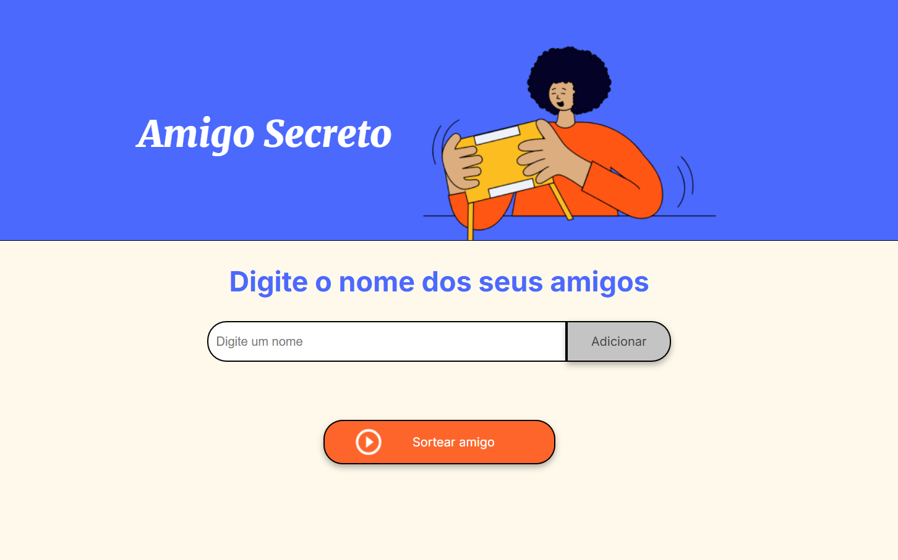
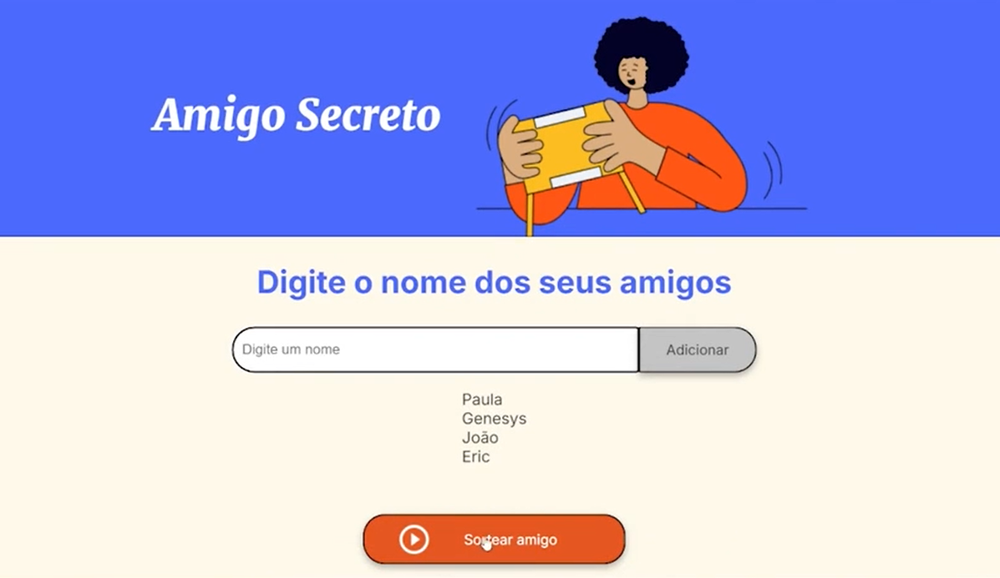
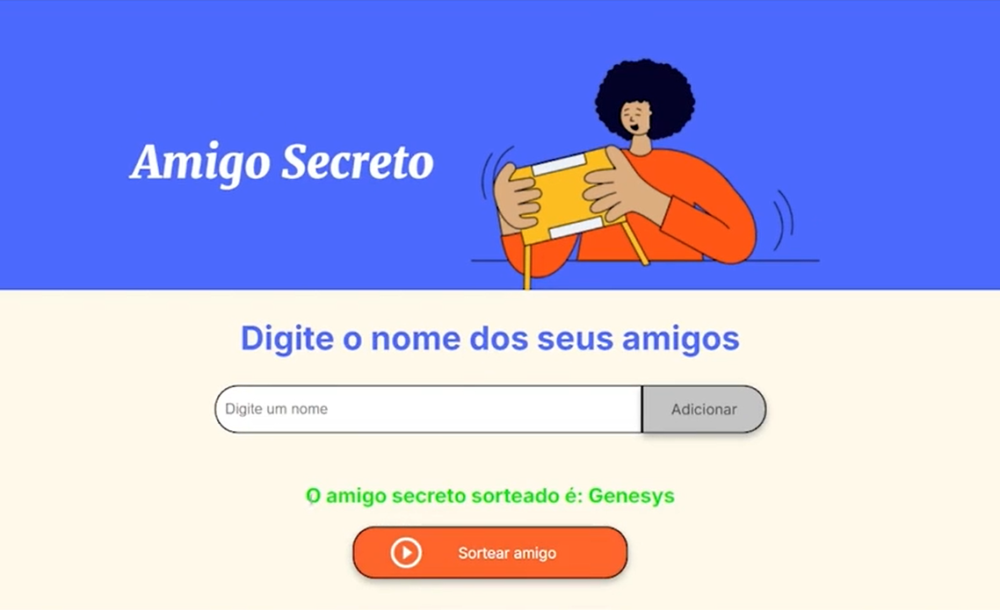

# 🤝 Amigo Secreto
O site Amigo Secreto, permite aos usuários inserir nomes em uma lista e logo depois realizar um sorteio para determinar quem é o Amigo Secreto. 
<b>
# 📸 Screenshots
<!-- You can add more screenshots here if you like -->
&emsp;&emsp;


# 📲 Como Acessar o Aplicativo
Para utilizar o aplicativo, click no link já publicado gratuitamente:


# ☑️ O Que Vem no Aplicativo
O aplicativo possui:<br>
	- um botão ao lado direito do campo chamado 'Adicionar';<br>
	- um botão logo abaixo chamado 'Sortear Amigo';<br>

 # 📘 Como Utilizar o Aplicativo
 O aplicativo é fácil de utilizar, siga os passos abaixo para obter sucesso na utilização.<br>
       1. Digite o nome da pessoa no campo 'Digite um Nome'. Não é permitido campo em branco;<br>
       2. Click em 'Adicionar', e logo verá o nome abaixo - O nome foi inserido na lista;<br>
       3. Repita a operação 1. e 2. até que atinja a quantidade desejada de pessoas na lista; e<br>
       4. click no botão 'Sortear Amigo' para que o sistema Selecione o Amigo Secreto.

# 💻 Tecnologias
* HTML
* CSS
* JavaScript
  - variáveis;
  - arrays;
  - funções; e
  - condicionais.


# 📖 TO DO
- Melhorar estilização do site.


## 🧔 Author
Maurício G (follow me on [Twitter](https://twitter.com/maumauriciog))


## 🔖 License
```
The MIT License (MIT)

Copyright (c) 2025 Maurício Gomes das Chagas

Permission is hereby granted, free of charge, to any person obtaining a copy of
this software and associated documentation files (the "Software"), to deal in
the Software without restriction, including without limitation the rights to
use, copy, modify, merge, publish, distribute, sublicense, and/or sell copies of
the Software, and to permit persons to whom the Software is furnished to do so,
subject to the following conditions:

The above copyright notice and this permission notice shall be included in all
copies or substantial portions of the Software.

THE SOFTWARE IS PROVIDED "AS IS", WITHOUT WARRANTY OF ANY KIND, EXPRESS OR
IMPLIED, INCLUDING BUT NOT LIMITED TO THE WARRANTIES OF MERCHANTABILITY, FITNESS
FOR A PARTICULAR PURPOSE AND NONINFRINGEMENT. IN NO EVENT SHALL THE AUTHORS OR
COPYRIGHT HOLDERS BE LIABLE FOR ANY CLAIM, DAMAGES OR OTHER LIABILITY, WHETHER
IN AN ACTION OF CONTRACT, TORT OR OTHERWISE, ARISING FROM, OUT OF OR IN
CONNECTION WITH THE SOFTWARE OR THE USE OR OTHER DEALINGS IN THE SOFTWARE.
```
